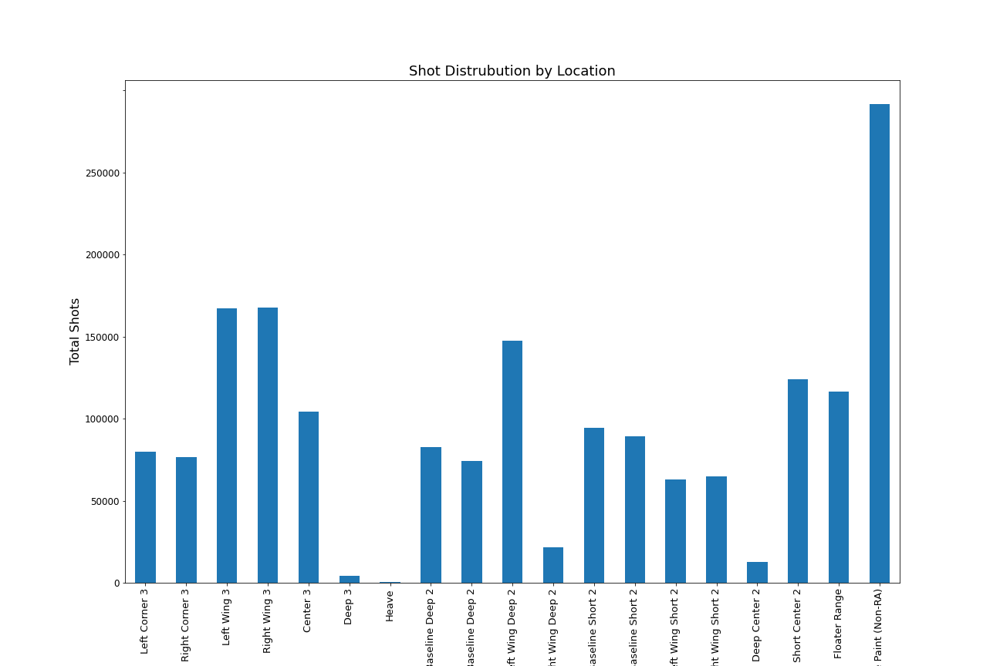

# NBA_Position_Classifier

## Project Overview

Classifying nba players by position is simple enough, taller players who get rebounds are centers, smaller players who get assists are point guards. But if you take size out of the equation, how good will it be? Well thats what im trying to figure out. The 5 positions themselves have been defined since the game started, with rare exceptions. But now i want to take the skill aspect, the shooting position of players, points, rebounds, assists, etc without any of the physical measurements and classify players. I started with the idea of using the generally defined 5 positions as the classes but as i went along and ran models, as well as thought more about it with the way the modern nba is played i found that actually a 3 class classification makes more sense. The reason is that power forwards and centers (the 2 big man positions) operate in very similar ways from where they shoot from to the high rebounds and blocks. and small forwards and shooting guards in the nba have become very malleable now a days and thinking back the only thing that made someone a shooting guard vs a small forward was if they were 6'7" or shorter/taller depending on position. So in my new model i decided to go with 3 classes, Point guards, who are very distinct in style, shooting guards and centers.

Obviously the point of the classification model is to achieve a high accuracy but i had another idea in mind as well, what if my model is wrong, but its wrong because a player is just classified poorly. Well thats what i hope to achieve, i want a good model not based solely on how well it scores but how well it classifies players by their style of play. So someone like Dirk Nowitzki who shoots like a wing is classified as such and its important to know that when building a team around him. Because even if he is a big since he plays like a wing you need another big to complement him.

## Process and Data Gathering

So to do this i used 2 main things from the nba api and basketball reference page. The shooting locations over a 20 year span which can be obtained through the nba api. And the yearly per game averages of the players obtained through the basketball reference pages. These along with a ton of feature engineering are the biggest factors in the modeling. (more to come in the future including defensive statistics).

I got 650k+ shots for about 2000 nba players over the last 2 decades as well as their yearly per game stats,

## Github Repo Content

- Images: Collection of all the images gathered through eda including nba player shot charts and breakdown of the shot distribution over the years

- CSV Files: Collection of all the CSV files gathered throughout the entire data gathering, data cleaning and feature creation processes

- mod_5_functions: python file with the large functions that were used in the notebooks. meant to keep the notebooks themselves much clearner and be able to slim down the large notebooks

- nba_data_gathering notebook: gathering all the available data from the nba_api. Gathered shot charts from 2000 to 2020 but because the file was too large to include in the github i added a smaller file with shot charts from just the last season, this can be used as a replacement to run all the code 

- bbref_data_gathering notebook: gathering the player bios for the last 20 years, this include points, rebounds, assists, field goal %, etc

- Defensive stats and shot charts notebooks: these both served the same purpose. to take the data from the nba api and be able to convert it to values that could be used in a model in the future. You can see my breakdown of the court below as well as the breakdown of the values for each shot location

.png)

- Modeling and EDA notebook: The final notebook, this has all of the EDA analysis, shot charts, shot value graphs, etc meant to get an idea of the features and be able to clean them up further if necessary. Also has all of the models for both 3 and 5 class models, including dummy classifier, XGBoost classifier, random forest classifier and support vector machine classifier and an analysis of the results using feature coefficients and confusion matrices

## Reproduction instructions

THe only thing that needs to be changed for some of the edas is to run the 2019/20 shot charts file instead of the 2000-2020 file since that was too large to include. When running models it can be run top to bottom for everything except the eda

## Conclusion

The best model was a support vector machine that got about an 85% accuracy and did well with the f1 score as well. So the skill set of players does a relatively good job in classifying the players but the best aspect as I mentioned in the intro was for players like Dirk Nowitzki who is a big but got classified as a wing because of his diverse shooting profile. These are the players who I was most curious about because even though Dirk is classified as a big because of his skill set it is very important to use him like a wing and build around him like a wing. And thats what the Mavericks did in summer of 2010 signing another big in Tyson chandler who has the skill set of a big and that complementary skill was a big part of why the Mavericks won the championship in that same season. This is what i want to get out of the classifier to be able to input a player and output their actual position based on skill.

## Next Steps

Tying in to the above building a front end to be able to enter a players name and output their position is a future goal. 

Also being able to use an unsupervised model alongside this model so that it can compare players and find the most similar players regardless of position. This is somewhat apart from the actual classification but it is an important thing that can be used, especially for role players who generally only have 2/3 year contracts with teams. If someone comes in and fits in well with a team being able to find a similar replacement in case he leaves is important.

Lastly including more defensive metrics would be valuable to the data, especially for the comparison, as sometimes the offensive skill set is not what makes players valuable but instead the defensive skills. I already set up a dataframe with this in the notebook but due to time constraints and the fact that not all the players from my original model had the defensive tracking data meant it didnt have great value for the classification.

## Presentation Link

https://docs.google.com/presentation/d/1DMR6XEHKJiMgS-UF0zZWL_KOSlFBALFC0YeXH5uleaI/edit?usp=sharing

## Citations

- http://savvastjortjoglou.com/nba-shot-sharts.html
  - used to create nba court to map the data i have 
  
- https://www.geeksforgeeks.org/python-find-most-frequent-element-in-a-list/
  - code to find the most common word in a string (just done to simplify the work)

- https://stackoverflow.com/questions/44511636/matplotlib-plot-feature-importance-with-feature-names/49157712
  - code to find the feature importance of svm models
  
- https://www.123rf.com/photo_9886489_basketball-sequences.html
- https://www.ppt-backgrounds.net/basketball/8193-basketball--basketball-court-wood---presentation-background-backgrounds.html
- https://basketballphantom.com/position-play-basketball/
  - images used in presentation
